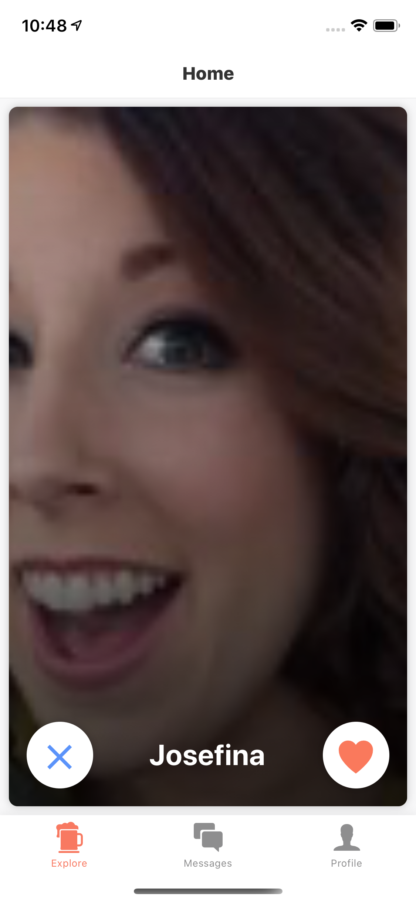

# Matched

This project was created as an example app to using React Native with Managed Expo. The app also used React-Navigation.

Managed Expo v0.39

### Demo

[Demo on Expo Client](https://expo.io/@cameronmoreau/matched)

or type `exp://exp.host/@cameronmoreau/matched`

### Screenshots

## Libraries

- [expo](https://github.com/expo/expo): Platform on top of react-native to manage native platform code
- [react-navigation](https://github.com/react-community/react-navigation): Routing, changing pages, tabs/navbar, all that good stuff
- [react-native-animatable](https://github.com/oblador/react-native-animatable): Super easy animations
- [react-native-gifted-chat](https://github.com/FaridSafi/react-native-gifted-chat): Chat bubbles like iMessage

## Resources

- [Learn flexbox - Game #1](http://flexboxfroggy.com/)
- [Learn flexbox - Game #2](http://www.flexboxdefense.com/)
- [React Native Radio - Podcast](https://devchat.tv/react-native-radio)
- [Example App - F8](https://github.com/fbsamples/f8app)
- [Example App - HackerNews](https://github.com/iSimar/HackerNews-React-Native)
